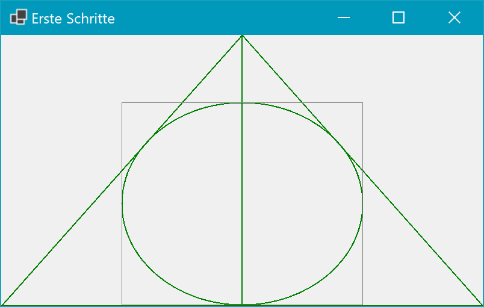
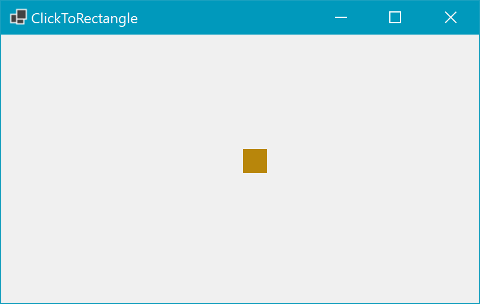
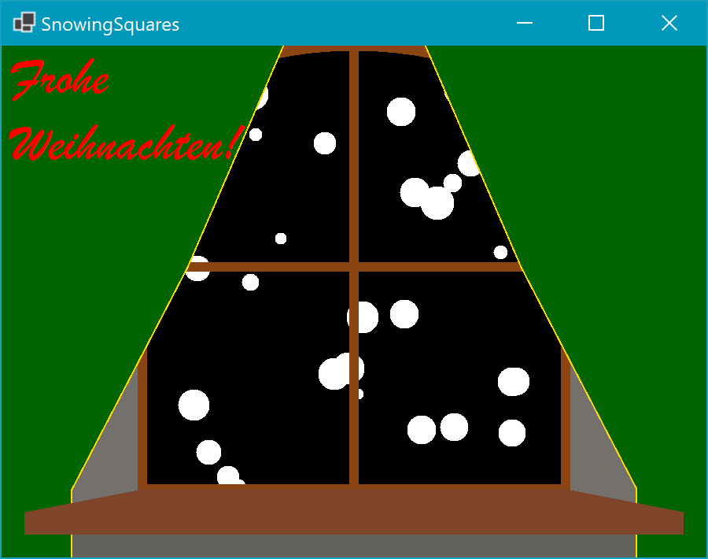

# gdiplusShowcase
Hier finden sich Beispiele zur Arbeit mit GDI+ unter WindowsForms.

Jede Form hat ein eigenes Thema. Es sind immer nur die .cs Dateien (nicht Designer.cs oder .resx) relevant.

## Basics

### Erste Schritte

[Link zum Code](./KunstOderSo/ErsteSchritte.cs)
- Paint Ereignis
- Point- und Rectangle-Objekte
- Neuzeichnen bei Größenänderung (ResizeRedraw)
- Draw Anweisungen 

### ClickToRectangle

[Link zum Code](./Basics/ClickToRectangle.cs)
- MouseClick()
- Kooridnaten der Maus abfragen
- Darstellung von Rectangles an gleicher Stelle

### SimpleTimer
Ein einfaches Beispiel für Animation durch einen Timer.
- Timer erzeugen
- Einstellungen vornehmen (Interval)
- Tick-Ereignis manuell hinzufügen
- Im Tick-Ereignis ein Rechteck-Objekt manipulieren

## Kunst Oder So

### SnowingSquares

Ein Weihnachtsgruß :)
